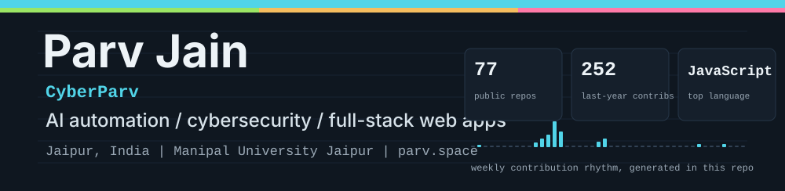
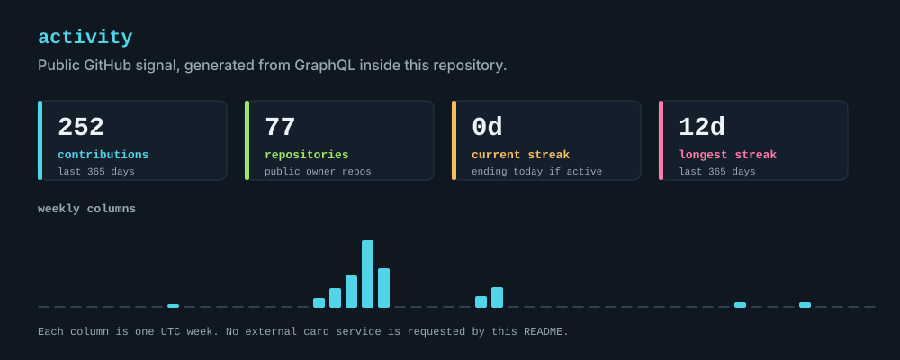
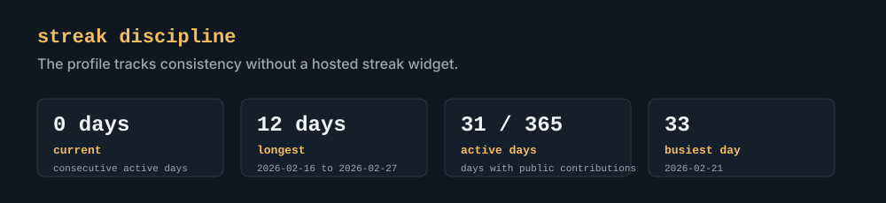
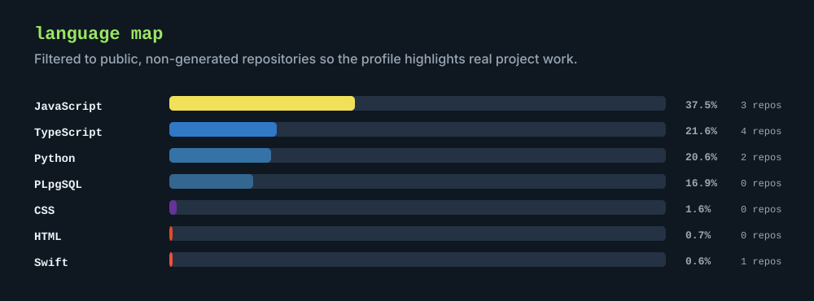
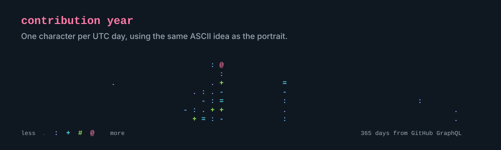
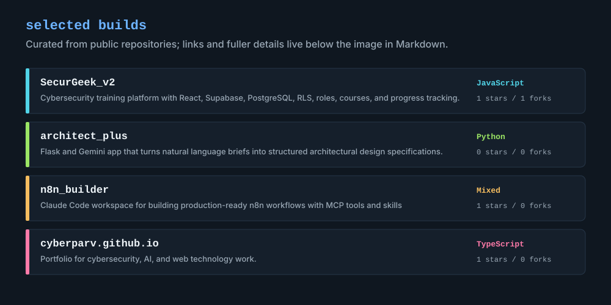

<!-- profile-readme: self-generating CyberParv profile -->

  

  

> <samp>Software engineer building AI-powered automation at thinQit. Fourth-year CSE student at Manipal University Jaipur, exploring cybersecurity and shipping practical web apps.</samp>

  <a href="https://parv.space">Website</a> /
  <a href="https://www.linkedin.com/in/parv-jain-7071392b3/">LinkedIn</a> /
  <a href="https://github.com/CyberParv">GitHub</a>

  

  

  

  

## Featured Work

  

- [SecurGeek_v2](https://github.com/CyberParv/SecurGeek_v2) - Cybersecurity training platform built with React, Vite, Tailwind, Supabase, PostgreSQL, and row-level security.
- [architect_plus](https://github.com/CyberParv/architect_plus) - Flask application that uses Gemini to turn natural language into structured architectural design specifications.
- [n8n_builder](https://github.com/CyberParv/n8n_builder) - Workspace for building production-ready n8n workflows with MCP tooling and reusable agent skills.
- [cyberparv.github.io](https://github.com/CyberParv/cyberparv.github.io) - Portfolio focused on cybersecurity, AI, and web technologies.

## Current Focus

<samp>
Cybersecurity training products / AI-assisted automation / React and TypeScript applications / Supabase and PostgreSQL / Python tooling
</samp>

## How This Profile Updates Itself

This repository owns every visible graphic in the profile. A scheduled GitHub Action runs `scripts/generate_profile.py`, reads public GitHub data through GraphQL, redraws the SVG assets under `assets/generated/`, and commits only when the generated files change. There are no third-party README card services in the render path.
